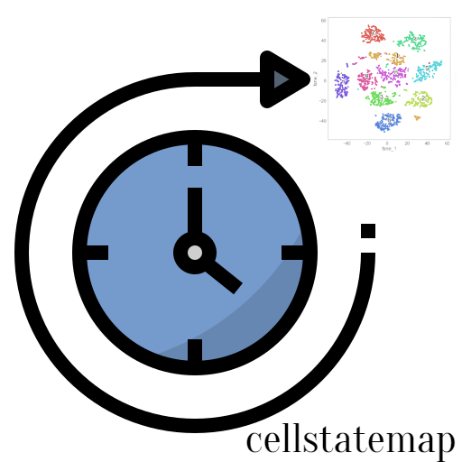

<!-- PROJECT LOGO -->
<br />
<div align="center">
  <a href="[https://github.com/othneildrew/Best-README-Template](https://www.notion.so/ozangocmen/GQA-BI-4d189b288fa74a2dbb6df81cf47ea76d)">
    
  </a>

  <h3 align="center">cellstatemapping</h3>

  <p align="center">
    Compilation for revealing cancer associated immune cells states
    <br />
    <a href="https://www.cell.com/cell-reports/fulltext/S2211-1247(21)01471-6?_returnURL=https%3A%2F%2Flinkinghub.elsevier.com%2Fretrieve%2Fpii%2FS2211124721014716%3Fshowall%3Dtrue"><strong>Explore the docs »</strong></a>
    <br />
    <br />
    <a href="https://github.com/ozangocmen/cellstatemapping/wiki">View Demo</a>
    ·
    <a href="https://sites.google.com/view/tcellsdli/home?authuser=0&pli=1">Access to data</a>
    ·
    <a href="https://github.com/ozangocmen/cellstatemapping/issues">Report Bug</a> 
 
  </p>
</div>


<!-- TABLE OF CONTENTS -->
<details>
  <summary>Table of Contents</summary>
  <ol>
    <li>
      <a href="#about-the-project">About The Project</a>
      <ul>
        <li><a href="#built-with">Built With</a></li>
      </ul>
    </li>
    <li>
      <a href="#getting-started">Getting Started</a>
      <ul>
        <li><a href="#prerequisites">Prerequisites</a></li>
        <li><a href="#installation">Installation</a></li>
      </ul>
    </li>
    <li><a href="#usage">Usage</a></li>
    <li><a href="#roadmap">Roadmap</a></li>
    <li><a href="#contributing">Contributing</a></li>
    <li><a href="#license">License</a></li>
    <li><a href="#contact">Contact</a></li>
    <li><a href="#acknowledgments">Acknowledgments</a></li>
  </ol>
</details>


<!-- ABOUT THE PROJECT -->
## About The Project
<div align="center">
  

  
</div>
<p>
This repository's purpose is developing a stand alone package which will reveal cancer associated immune cells states with unsupervised machine learning algorithms. Here methods are derived from this paper: Bachireddy et. al. (2021). Mapping the evolution of T cell states during response and resistance to adoptive cellular therapy. Cell Reports, 37(6), 109992._ https://doi.org/10.1016/j.celrep.2021.109992</p> 

<p>Software included mainly R and Python functions.</p>


**Objectives of cellstate_mapping**
- Reproduce the results using non-PCA based, with annotation and interpretation of major common factors.
- Inspect whether the non-responsive patients are driven by common or different resistance mechanisms in datasets.
- Creating a meta-clustering scheme to account for within-cluster variability. 
- The implementation of a GP regression model.


<p align="right">(<a href="#readme-top">back to top</a>)</p>


<!-- GETTING STARTED -->
## Getting Started

This is an example of how you may give instructions on setting up your project locally.
To get a local copy up and running follow these simple example steps.

### Prerequisites

### Dependencies
The following packages are required to run the demo notebooks. 

```
numpy
pandas
torch
pyro-ppl
tqdm
```


<!-- LICENSE -->
## License

Distributed under the MIT License. See `LICENSE.txt` for more information.

<p align="right">(<a href="#readme-top">back to top</a>)</p>


<!-- CONTACT -->
## Contact

<p>Ozan Gocmen - ozanngocmen@gmail.com</p>


Project Link: [https://github.com/ozangocmen/cellstatemapping](https://github.com/ozangocmen/cellstatemapping)

<p align="right">(<a href="#readme-top">back to top</a>)</p>


<!-- ACKNOWLEDGEMENTS -->
## Acknowledgements 


